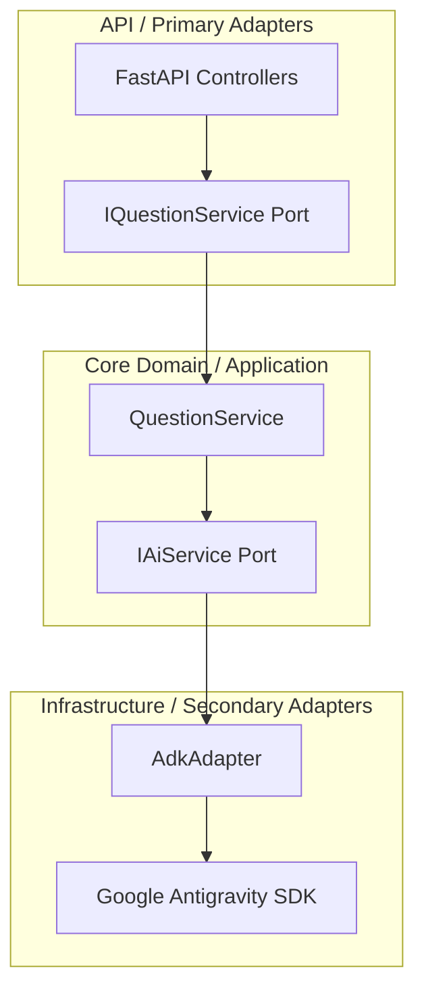

# 🛰️ Interview Pillot

An advanced AI-powered Interview Question Generator designed to generate high-quality, relevant, and role-specific interview questions. The project is split into a modern React+Vite frontend and a modular FastAPI backend designed using Hexagonal (Ports & Adapters) Architecture.

---

## 🏗️ Repository Architecture

This repository is organized as a monorepo containing two main parts:

```
interview-pillot/
├── backend/               # FastAPI Backend
│   ├── api/               # API Controllers & Middlewares (FastAPI entry point)
│   ├── application/       # Application Services (Use Cases / Orchestration)
│   ├── domain/            # Domain Core (Business models & interfaces/ports)
│   ├── infrastructure/    # Concrete Adapters (ADK adapter, external APIs)
│   ├── tests/             # Pytest Unit & Integration tests
│   └── GEMINI.md          # Backend coding rules & guidelines
├── frontend/              # React + Vite Frontend
│   ├── src/               # React components, stylesheets, hooks, and views
│   └── vite.config.js     # Bundler configuration
└── README.md              # Root Documentation
```

### 🔹 Architectural Philosophy

The backend is built around **Hexagonal Architecture (Orthogonality & Separation of Concerns)** to decouple business rules from external technologies (like the LLM runner, database, or API layer).



- **Domain Core (`backend/domain`)**: Contains core models (`InterviewQuestion`) and defines the interfaces (**Ports**) like `IAiService`. It has no knowledge of external frameworks.
- **Application Layer (`backend/application`)**: Implements application services (`QuestionService`) orchestrating the use cases using abstract ports.
- **Infrastructure (`backend/infrastructure`)**: Implements concrete **Adapters** such as `AdkAdapter` (powered by **Google Antigravity SDK - ADK**) to generate questions from the LLM.
- **API (`backend/api`)**: Represents primary adapters exposing FastAPI endpoints, managing HTTP middleware, validation schemas, and exceptions using standard decorators.

---

## ⚡ Quick Start

### 1. Prerequisites

- **Python**: `>= 3.14` (installed and managed with `uv`)
- **Node.js**: `>= 18` (with `npm`)

---

### 2. Backend Setup

The backend utilizes `uv` for lightning-fast Python dependency management.

1. **Navigate to the backend directory**:
   ```bash
   cd backend
   ```

2. **Install dependencies and create a virtual environment**:
   ```bash
   uv sync
   ```

3. **Set up Environment Variables**:
   Create a `.env` file inside `backend/`:
   ```env
   # Backend Environment Config
   PORT=8000
   AI_MODEL=gemini-2.5-flash
   # Add your Google GenAI API keys here if required by the ADK adapter
   GEMINI_API_KEY=your_gemini_api_key_here
   ```

4. **Run the Development Server**:
   ```bash
   uv run uvicorn api.main:app --reload --port 8000
   ```
   The backend API will be available at `http://localhost:8000`. You can access the interactive Swagger documentation at `http://localhost:8000/docs`.

5. **Run Tests**:
   ```bash
   uv run pytest
   ```

---

### 3. Frontend Setup

The frontend is a sleek, modern React application built using Vite.

1. **Navigate to the frontend directory**:
   ```bash
   cd frontend
   ```

2. **Install node packages**:
   ```bash
   npm install
   ```

3. **Configure dev proxy**:
   Vite is preconfigured to proxy API calls to `http://localhost:8000` via its dev server configs.

4. **Start Vite Development Server**:
   ```bash
   npm run dev
   ```
   Open `http://localhost:5173` in your browser.

---

## 🛡️ Coding Standards

To maintain clean and maintainable code, follow these principles:

- **Type Hints**: Mandatory for all function signatures in the backend.
- **Google Docstrings**: Document every class and public-facing method using Google-style documentation.
- **Error Handling**: Use the `@exception_before_advice` decorator on all API endpoints for standardized error formats.
- **Component Design**: Keep frontend React components isolated, highly styled, and functional.
